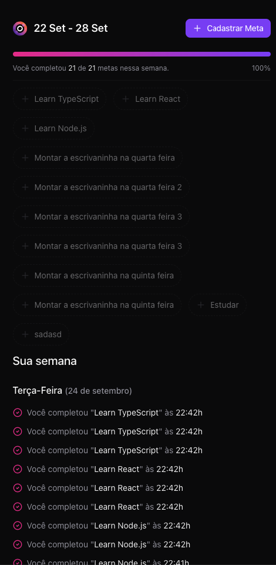

# Pocket-JS | in-orbit organizer




## Backend

```bash
docker-compose up -d    # Banco de dados (PostgreSQL + Drizzle ORM)
npm run dev             # localhost:3333
```

## Frontend

```bash
npm run dev             # localhost:5173
```

## Dependências

* [Docker](https://www.docker.com/get-started/)
* [Node](https://nodejs.org/)
* [IDE VSCode](https://code.visualstudio.com/)
